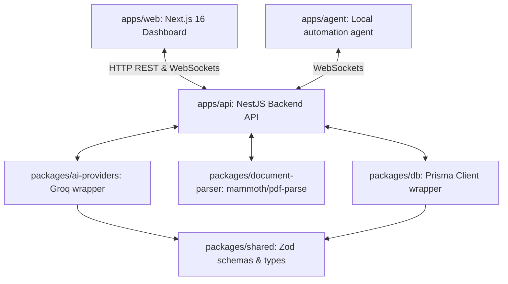
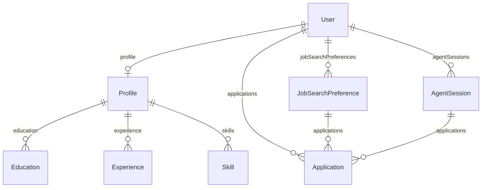
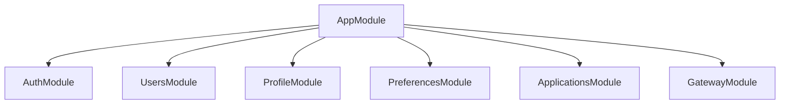
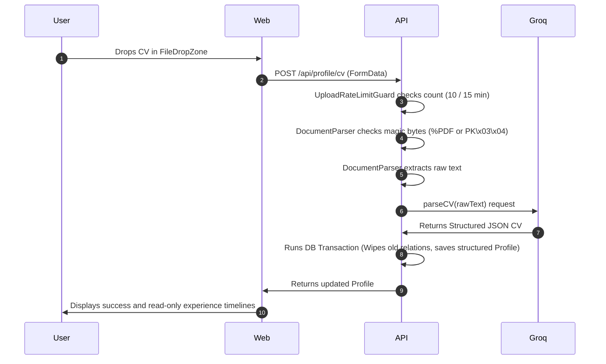
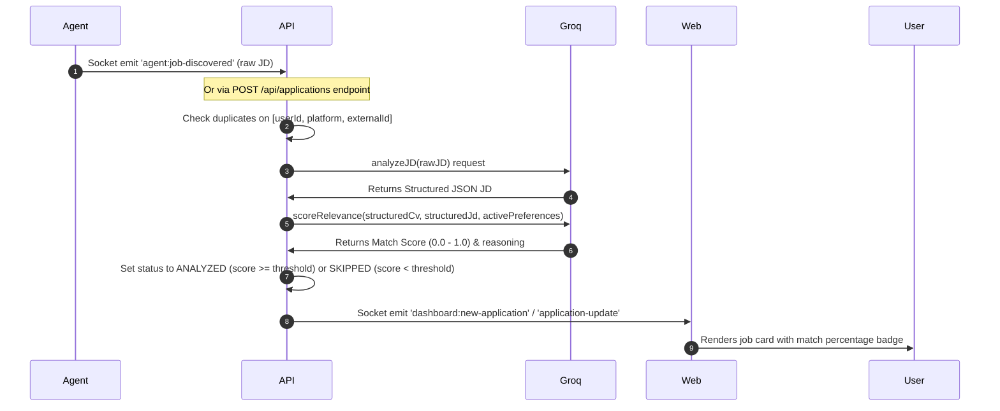
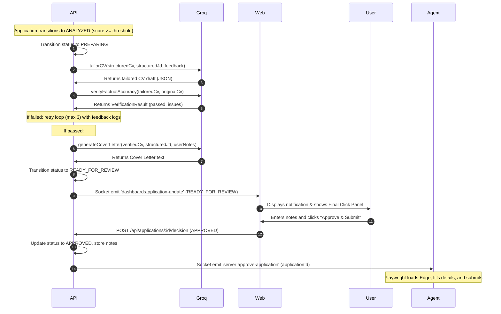

# Scout — Current Codebase State & Architecture Audit

This document provides a technical audit of the Scout codebase as of July 24, 2026. It details the active architecture, schemas, logic, frontend pages, and background communication channels based on a comprehensive audit of the code.

---

## 1. High-Level Architecture & Tech Stack

Scout is structured as a monorepo managed via `pnpm` workspaces. The codebase uses Turborepo to orchestrate builds, syntax checks, formatting, and database setup.



### Monorepo Workspaces & Directory Mapping

*   **`apps/api`**: NestJS REST API server and WebSocket Gateway. It connects directly to PostgreSQL, coordinates the scraper agent, runs the AI validation/matchmaking pipeline, and proxies real-time updates.
*   **`apps/web`**: Next.js 16 Web Dashboard using the App Router, TanStack Query, Zustand, next-intl for localization, and CSS variables for theming.
*   **`apps/agent`**: A standalone Node.js/TypeScript desktop agent process. It runs Microsoft Edge under Playwright and establishes Socket.io channels with the backend to scrape listings and submit applications.
*   **`packages/shared`**: Shared TypeScript models, contracts, Zod schemas, constants, and utility helpers.
*   **`packages/db`**: Database definition package bundling the Prisma client, seeding procedures, and local migrations.
*   **`packages/document-parser`**: A helper library utilizing `pdf-parse` and `mammoth` to parse text and check binary signatures.
*   **`packages/ai-providers`**: AI connector module executing structured queries against Groq APIs.

---

## 2. Database Schema (Prisma)

The PostgreSQL data model is defined in [`packages/db/prisma/schema.prisma`](file:///c:/projects/scout/packages/db/prisma/schema.prisma):



### Model Definitions

#### `User` (`users`)
Represents the account credential and core relationship owner.
*   `id` (String, Primary Key): Unique CUID identifier.
*   `email` (String, Unique): User's registration email address.
*   `passwordHash` (String): Bcrypt-hashed password.
*   `firstName` / `lastName` (String): User's profile name details.
*   `isActive` (Boolean, Default `true`): Flag for account status.
*   `createdAt` / `updatedAt` (DateTime).

#### `Profile` (`profiles`)
Maintains professional details extracted from the user's CV.
*   `id` (String, Primary Key): Unique CUID identifier.
*   `userId` (String, Unique): Foreign key referencing `User.id` (on delete cascade).
*   `headline` / `summary` / `phone` / `location` (String, Optional): Professional baseline.
*   `linkedinUrl` / `githubUrl` / `portfolioUrl` / `websiteUrl` (String, Optional): Verified social coordinates.
*   `rawCvText` (String, Optional): Extracted text representation of the CV.
*   `structuredCv` (Json, Optional): Structured JSON object representing the parsed CV.
*   `cvFileName` (String, Optional): Name of the uploaded CV file.
*   `cvLastParsedAt` (DateTime, Optional).

#### `Education` (`education`)
*   `id` (String, Primary Key): Unique CUID.
*   `profileId` (String): Foreign key referencing `Profile.id` (on delete cascade).
*   `institution` / `degree` (String): Institution name and degree earned.
*   `fieldOfStudy` (String, Optional).
*   `startDate` / `endDate` (DateTime, Optional).
*   `description` (String, Optional).
*   `sortOrder` (Int, Default `0`): Used for visual ordering.

#### `Experience` (`experiences`)
*   `id` (String, Primary Key): Unique CUID.
*   `profileId` (String): Foreign key referencing `Profile.id` (on delete cascade).
*   `company` / `title` (String): Employer name and position title.
*   `location` (String, Optional).
*   `startDate` / `endDate` (DateTime, Optional).
*   `isCurrent` (Boolean, Default `false`).
*   `description` (String, Optional).
*   `highlights` (String[]): Array of bullet point accomplishments.
*   `sortOrder` (Int, Default `0`).

#### `Skill` (`skills`)
*   `id` (String, Primary Key): Unique CUID.
*   `profileId` (String): Foreign key referencing `Profile.id` (on delete cascade).
*   `name` (String): Name of the skill (e.g. "TypeScript").
*   `category` (String, Optional): Category grouping.
*   `proficiency` (Enum: `BEGINNER`, `INTERMEDIATE`, `ADVANCED`, `EXPERT`, Optional).
*   *Unique Constraint*: Unique compound index on `(profileId, name)`.

#### `JobSearchPreference` (`job_search_preferences`)
Stores search filters used by the agent to target matching job postings.
*   `id` (String, Primary Key): Unique CUID.
*   `userId` (String): Foreign key referencing `User.id` (on delete cascade).
*   `name` (String): Label for the search preference.
*   `isActive` (Boolean, Default `true`): Denotes the active search query.
*   `roles` (String[]): Target role designations.
*   `keywords` (String[]): Job description keywords.
*   `locations` (String[]): Targeted geographies.
*   `remoteOnly` (Boolean, Default `false`).
*   `experienceLevels` (String[]): Targeted job seniorities.
*   `minSalary` / `maxSalary` (Int, Optional).
*   `salaryCurrency` (String, Default `"USD"`).
*   `excludeCompanies` (String[]): Blacklisted companies.
*   `maxPostAgeDays` (Int, Default `7`).
*   `relevanceThreshold` (Float, Default `0.6`): Score boundary (0.0 to 1.0) above which matching jobs are prepared.

#### `Application` (`applications`)
Tracks matching job opportunities and the user's application process.
*   `id` (String, Primary Key): Unique CUID.
*   `userId` (String): Foreign key referencing `User.id` (on delete cascade).
*   `preferenceId` (String, Optional): Links to the `JobSearchPreference` that matched it (on delete set null).
*   `agentSessionId` (String, Optional): Links to the active `AgentSession` (on delete set null).
*   `platform` (String, Default `"wellfound"`): Scraping platform.
*   `externalJobId` (String, Optional): Unique ID assigned by the job board.
*   `jobUrl` / `jobTitle` / `companyName` (String).
*   `companyUrl` / `jobLocation` / `salary` (String, Optional).
*   `postedAt` (DateTime, Optional).
*   `jobDescription` (String, Optional): Raw text of the job description.
*   `structuredJd` (Json, Optional): Structured JSON parsed from the job description.
*   `relevanceScore` (Float, Optional): Relevance score (0.0 to 1.0).
*   `relevanceReasoning` (String, Optional): AI reasoning explaining the score.
*   `tailoredCv` (Json, Optional) & `coverLetter` (String, Optional): Tailored documents (stubs).
*   `verificationResult` (Json, Optional): JSON audits verifying tailored claim truthfulness against the original CV.
*   `status` (Enum: `DISCOVERED`, `ANALYZING`, `ANALYZED`, `SKIPPED`, `PREPARING`, `READY_FOR_REVIEW`, `APPROVED`, `SUBMITTING`, `SUBMITTED`, `SUBMISSION_FAILED`, `REJECTED`, Default `DISCOVERED`).
*   `statusHistory` (Json[]): Array logs mapping state transitions.
*   `userDecision` (Enum: `APPROVED`, `REJECTED`, `DEFERRED`, Optional): Selected option on the review panel.
*   `userNotes` (String, Optional): Optional notes submitted during approval.
*   `decidedAt` / `submittedAt` (DateTime, Optional).
*   *Unique Constraint*: Unique compound index on `(userId, platform, externalJobId)`.

#### `AgentSession` (`agent_sessions`)
Represents a connection session for the local agent.
*   `id` (String, Primary Key): Unique CUID.
*   `userId` (String): Foreign key referencing `User.id` (on delete cascade).
*   `socketId` (String, Optional): ID of the active Socket.io connection.
*   `status` (Enum: `CONNECTING`, `CONNECTED`, `RUNNING`, `PAUSED`, `IDLE`, `DISCONNECTED`, `ERROR`, Default `CONNECTING`).
*   `machineInfo` (Json, Optional): Tracks client machine info (OS, Node, and Playwright versions).
*   `startedAt` / `endedAt` (DateTime).
*   `lastHeartbeat` (DateTime, Optional).
*   `endReason` (String, Optional).
*   `jobsScanned` / `jobsAnalyzed` / `jobsApplied` (Int, Default `0`): Counters for the active session.
*   `errors` (Json[]): Log array capturing agent errors.

---

## 3. Backend Logic (NestJS - `apps/api`)

The backend is built with NestJS. Config values loaded from the root `.env` are parsed at boot time in [`apps/api/src/config/env.validation.ts`](file:///c:/projects/scout/apps/api/src/config/env.validation.ts) using Zod.

### Core Modules



#### 1. Authentication (`AuthModule`)
*   **Protocol**: Token-only authentication utilizing HTTP-Only cookies named `token`. No refresh tokens are exposed.
*   **Password Security**: Hashed via bcrypt with a cost factor of `12` rounds.
*   **Endpoints**:
    *   `POST /api/auth/register`: Creates a user, hashes their password, sets a 7-day cookie, and returns user details.
    *   `POST /api/auth/login`: Validates credentials, sets the cookie, and returns user details.
    *   `POST /api/auth/logout`: Clears the `token` cookie.
    *   `GET /api/auth/me`: Retrieves current session user details (guarded by `JwtAuthGuard`).

#### 2. Profile Management (`ProfileModule`)
*   **Endpoints**:
    *   `GET /api/profile`: Retrieves the profile details, including the normalized `education`, `experience`, and `skills` lists. If no profile exists, a blank profile record is initialized.
    *   `PUT /api/profile`: Updates contact links and headlines.
    *   `POST /api/profile/cv`: Uploads a CV file (PDF or DOCX, up to 5MB).
*   **Upload Security & Operations**:
    *   *Rate Limiting*: `UploadRateLimitGuard` enforces a maximum of 10 uploads per 15 minutes window in memory.
    *   *Validation*: Express Multer checks the MIME type (`application/pdf`, `application/vnd.openxmlformats-officedocument.wordprocessingml.document`, `text/plain`).
    *   *Content Verification*: [`DocumentParserService`](file:///c:/projects/scout/packages/document-parser/src/services/document-parser.service.ts) verifies binary magic bytes (`%PDF` for PDFs, `PK\x03\x04` for DOCX) and scans plain text files for null bytes to block spoofed extensions.
    *   *Data Synchronization*: On successful validation, the parsed text is structured via Groq AI (`parseCV`). In a single database transaction inside [`ProfileService.saveRawCv`](file:///c:/projects/scout/apps/api/src/modules/profile/profile.service.ts#L51), the backend deletes old education/experience/skills records, updates profile fields, and inserts the newly structured education, experience, and skill lists.

#### 3. Job Search Preferences (`PreferencesModule`)
*   **Endpoints**:
    *   `GET /api/preferences`: Returns all preferences for the authenticated user.
    *   `GET /api/preferences/:id`: Returns details of a specific preference.
    *   `POST /api/preferences`: Creates a search preference set.
    *   `PUT /api/preferences/:id`: Updates an existing preference set.
    *   `DELETE /api/preferences/:id`: Removes a preference set.
*   **Database Constraints**:
    *   When saving a preference with `isActive: true`, the API updates all other search preferences for that user to `isActive: false` within a database transaction block.

#### 4. Applications (`ApplicationsModule`)
*   **Endpoints**:
    *   `GET /api/applications`: Retrieves paginated lists (defaulting to page 1, limit 20) with search queries (`search`), platform filters, and minimum relevance scores.
    *   `GET /api/applications/:id`: Retrieves details for a specific application.
    *   `POST /api/applications`: Submits raw job details for ingestion, matching, and scoring.
    *   `POST /api/applications/:id/decision`: Receives the user's decision (`APPROVED`, `REJECTED`, or `DEFERRED`) and any notes.
    *   `POST /api/applications/seed`: Seeds mock applications for local dashboard visualization (disabled in production).
*   **Business Logic**:
    *   `POST /api/applications` invokes `createAndAnalyze`. It checks for duplicate records using the compound index `[userId, platform, externalJobId]`. If none exist, it creates a new record. Next, it parses the job description using Groq (`analyzeJD`) and computes a relevance match score (`scoreRelevance`) against the user's structured CV and active search preferences.
    *   If the relevance score meets or exceeds the active preference threshold, the status updates to `ANALYZED`. If not, it is marked `SKIPPED`.
    *   `POST /api/applications/:id/decision` restricts transitions to applications in the `READY_FOR_REVIEW` state. If the user selects `APPROVED` or `REJECTED`, the gateway updates the status in the database and emits a socket event (`server:approve-application` or `server:reject-application`) to the active agent socket.

#### 5. Real-Time Gateways (`GatewayModule`)
Consists of two namespace gateways coordinated by the in-memory socket registry [`SocketState`](file:///c:/projects/scout/apps/api/src/modules/gateway/socket.state.ts):

*   **`AgentGateway` (`/agent` namespace)**:
    *   Guards connection entry via JWT token verification. On successful authentication, it registers the socket in `SocketState` (evicting older client sockets for the same user) and logs a connected `AgentSession` in the database.
    *   Periodically runs a heartbeat checker (disconnects the client socket after 2 minutes of silence, checked every 30 seconds).
    *   Listens to agent events (`agent:status-update`, `agent:session-stats`, `agent:error`, and job lifecycle events) and relays updates to the `DashboardGateway`.
*   **`DashboardGateway` (`/dashboard` namespace)**:
    *   Guards connections via `WsAuthGuard` (JWT extraction from cookies/handshake payload).
    *   Allows clients to subscribe or unsubscribe.
    *   Provides an `emitToUser` method to send live status, stats, and notification payloads to all connected dashboards of a given user.

---

## 4. Frontend State & Pages (Next.js - `apps/web`)

The frontend uses Next.js 16 (App Router), styled with Vanilla CSS variables defined in [`apps/web/src/app/globals.css`](file:///c:/projects/scout/apps/web/src/app/globals.css).

### Routing Structure
The application enforces localized route prefixes `/en` and `/ar` via `next-intl`.

```
apps/web/src/app/
└── [locale]/
    ├── layout.tsx             # Root layout with Theme and Query Providers
    ├── page.tsx               # Redirects to /profile or /login
    ├── login/                 # Auth login form
    ├── register/              # Auth registration form
    ├── profile/
    │   ├── layout.tsx         # Dashboard layout (NavBar with links and Log Out)
    │   └── page.tsx           # CV uploader and read-only timeline components
    ├── preferences/
    │   ├── page.tsx           # Search preferences list view
    │   ├── new/               # Form to create a search preference
    │   └── [id]/
    │       └── edit/          # Form to edit a search preference
    └── applications/
        ├── page.tsx           # Tab-filtered applications grid
        └── [id]/
            └── page.tsx       # Detailed analysis and Final Click panel
```

### Components and State Integration

*   **Authentication & State**:
    *   [`AuthProvider`](file:///c:/projects/scout/apps/web/src/infra/auth-context.tsx) wraps the application, querying `/auth/me` via React Query to track session state (`['auth-user']`). It exposes login/register mutations and cleanups.
    *   Protected pages are wrapped in [`AuthGuard`](file:///c:/projects/scout/apps/web/src/infra/auth-guard.tsx), which intercepts unauthorized routing attempts.
*   **Theming**:
    *   Managed by a persisted Zustand store ([`useThemeStore`](file:///c:/projects/scout/apps/web/src/stores/theme.store.ts)), which sets the `data-theme` attribute (`light` or `dark`) on the root document element.
*   **WebSockets**:
    *   [`socket-client.ts`](file:///c:/projects/scout/apps/web/src/infra/socket-client.ts) initializes client socket connections for `/dashboard` and `/agent` namespaces.
*   **Forms & Input Validation**:
    *   [`PreferenceForm`](file:///c:/projects/scout/apps/web/src/components/preference-form.tsx) utilizes `react-hook-form` and validates using Zod (`createPreferenceSchema`). It maps text inputs to string arrays and formats salaries and thresholds.
*   **Final Click Panel**:
    *   Implemented in [`ApplicationDetailPage`](file:///c:/projects/scout/apps/web/src/app/%5Blocale%5D/applications/%5Bid%5D/page.tsx#L294). When an application's status is `READY_FOR_REVIEW`, it displays a panel where the user can enter notes and approve or reject the application. This action triggers `apiClient.applications.decide`, updating the database and sending a real-time event to the agent socket.

---

## 5. Agent Engine (apps/agent)

The agent process is scaffolded in TypeScript/Node.js, preparing for automated Playwright interactions.

*   **`AgentConnectionManager`**:
    *   Establishes socket connection to `${API_URL}/agent`.
    *   Authenticates by sending a JWT token and `MachineInfo` telemetry.
    *   Sets up a 30-second heartbeat loop (`agent:heartbeat`).
    *   Handles server commands: `server:pause`, `server:resume`, and `server:stop`. On command, it updates its status, notifies the server, and executes registered hooks.
*   **`BrowserManager`**:
    *   Idempotently launches Microsoft Edge in a persistent context (`chromium.launchPersistentContext`) at a specified user directory.
    *   Saves active `BrowserContext` and `Page` references for scraping and submission tasks.
*   **`PlatformRegistry`**:
    *   Registers and retrieves platform SDK adapters dynamically.
*   **`WellfoundPlatformSDK`**:
    *   Implements session verification, keyword routing searches, regex-based job details slug scraping, and parent DOM traversal lookup for listing cards.
*   **Stubs**:
    *   `pacing/index.ts` is an empty stub.

---

## 6. Core Data Flow

### 1. CV Intake & Parser Flow


### 2. Job Analysis & Match Scoring Flow


### 3. Factual Verification & Final Click Authorization Flow


---

## 7. Known Hardcoded/Stubbed Logic

*   **packages/ai-providers/src/providers/stubs.providers.ts**: Contains dummy placeholders for OpenAI, Gemini, and Claude integrations. These providers are not implemented and throw runtime errors if selected.
*   **packages/document-parser**: Plain text files are verified by searching for null bytes (`buffer[i] === 0`). More detailed character encoding checks are deferred.
*   **Tauri Desktop Native Wrapper**: Scaffolding for Tauri (desktop native notification popups and system-tray commands) has not yet been introduced.

---

## 8. Development Roadmap & Sprints

### Sprint-03: Wellfound Platform Scraper & Automation (Completed)
*   **Status**: Completed & E2E Validated.
*   **Agent Capabilities Implemented**:
    *   Dynamic platform driver loading through a thread-safe registry singleton.
    *   Edge/Chromium persistent-session verification bypassing Cloudflare and DataDome challenges (see [ADR-0009: Persistent Session Authentication Strategy](../knowledge/09-decisions/ADR-0009-persistent-session-authentication.md)).
    *   Deterministic locator-wait search patterns using a direct URL query fallback if the UI search box is covered.
    *   Job detail regex path parser (extracting slugs to prevent 404s).
    *   Hierarchical DOM parent-traversal to resolve company block headers.
    *   Cognitive Observe phase synchronization reading page coordinates and source content from Playwright worker result objects.
*   **Remaining Limitations**:
    *   Form-filling credentials login is blocked; the automation depends entirely on active persistent sessions (see [ADR-0009](../knowledge/09-decisions/ADR-0009-persistent-session-authentication.md)).
    *   Pacing delay intervals and native OS system-tray notifications are still stubbed.

### Sprint-04: CV Tailoring & Document Generation (Completed)
*   **Status**: Completed & Validated.
*   **Capabilities Implemented**:
    *   Separated AI generation responsibilities (`packages/ai-providers`) from business logic orchestration (`apps/api`).
    *   Built the core prompt tailoring engine, factual verification engine, and cover letter writer.
    *   Created `VerificationService` inside `apps/api` driving the tailoring/verification retry loop (maximum 3 attempts) and exponential backoff recovery on Groq rate limits (`429`).
    *   Stored the full verification audit trail history (attempt counts, pass/fail state, durationMs, and issues log) directly inside the database `verificationResult` column.
    *   Secured all inputs using strict type-safety checks and Jest automated suites validating rates, injection mitigation, and loop thresholds.
*   **Remaining Limitations**:
    *   Binary document rendering (compiled to PDF/DOCX files) is deferred to a future sprint; current deliverables are structured JSON objects in PostgreSQL.

### Sprint-05: Application Engine (Completed)
*   **Status**: Completed & Validated.
*   **Capabilities Implemented**:
    *   **Browser automation cycle**: Full Playwright automation of Wellfound application login checks, detail queries, form auto-filling, and submission steps.
    *   **Gated Final Click**: Handled session pauses waiting for dashboard decision. Blocks automation until user clicks "Approve & Submit" on dashboard.
    *   **Worker Thread Isolation**: Thread-safe worker subprocess runner preventing CPU-heavy Playwright automation tasks from blocking backend socket heartbeats.
    *   **Real-time Gates**: Web Socket relays updating dashboard status dynamically from `DISCOVERED` through `SUBMITTED`.

### Sprint-06: Multi-Platform Architecture Foundation (Completed)
*   **Status**: Completed & Validated.
*   **Capabilities Implemented**:
    *   **Hostname-based Registry**: Centralized `PlatformRegistry` resolving target SDK adapters automatically based on job URL hostnames.
    *   **Capability Manifests**: Standardized configuration interfaces tracking which platforms support automated discovery, autofill, custom questions, and final-click validation.
    *   **Adapter Stubs**: Registered initial stubs and configuration parameters for Bayt, LinkedIn Jobs, Greenhouse, Lever, Ashby, and Workday.

### Sprint-07: AI Application Intelligence Design (Completed)
*   **Status**: Completed & Validated.
*   **Capabilities Implemented**:
    *   **Architecture Design**: Completed detailed technical specifications for the two-axis classification, deterministic answer routes, claims verifier, and approved answer fingerprint caching.
    *   **ADR Audits**: Established design guidelines (ADR-0012 to ADR-0015) governing AI isolation, database model boundaries, and Never Lie validation policies.

### Sprint-08: AI Application Intelligence (Completed)
*   **Status**: Completed & Validated.
*   **Capabilities Implemented**:
    *   **IApplicationIntelligenceService**: High-level question answering orchestrator, separating pipeline execution from core AI providers.
    *   **Two-Axis Classifier**: Stateless, regex-based keyword engine classifying question types (semantic category & input type) without LLM runtime cost.
    *   **Deterministic-First Pipeline**: Bypasses LLMs for factual questions, performing direct database lookups for name/email/links, date arithmetic calculation for experience years, and option matching for constrained dropdown/radio lists.
    *   **Never Lie Validation**: Extract claims and verify against CV facts, enforcing 100% truthfulness. Fails validation for personal interactions or insider knowledge, retrying with correction feedback (max 2 retries) before falling back to `MANUAL_REQUIRED`.
    *   **Confidence Estimator**: Employs source baselines, validation offsets, and cache hits to score draft suggestions.
    *   **Answer Memory Cache**: PostgreSQL-backed history layer with prompt version check and compound cache key lookups.
    *   **AI Rate Limiter**: FIFO task queue with exponential backoff + jitter pacing to safeguard Groq API limits.
    *   **Web Review UI**: Inline custom question card editor enabling instant user edits or feedback-driven regeneration before Final Click.

### Sprint-09: Localized Landing Page, Footer & Legal Policies (Completed)
*   **Status**: Completed & Validated.
*   **Capabilities Implemented**:
    *   **Public Landing Page**: Replaced default redirection with a premium landing page layout under `/[locale]`. Features a rich Hero banner with dynamic loop cards, a Capabilities Grid (Observe, Think, Plan, Act, Verify), strict safety guidelines checklists, interactive FAQ accordions, and a public Contact form.
    *   **Public Contact API**: Public NestJS `/api/contact` endpoint validated via Zod schema, logging submissions to console.
    *   **5 Localized Legal Pages**: Created routes for Privacy Policy (`/privacy`), Terms of Service (`/terms`), Acceptable Use Policy (`/acceptable-use`), Cookie Policy (`/cookies`), and AI Safety & Ethics Declaration (`/ethics`), all sharing unified nav/footer branding.
    *   **Polished Vector Icons**: Replaced all emojis in the landing page, dashboard navbar, and notifications logs with Lucide React vector icons (Bot, Eye, Brain, FileText, Zap, ShieldCheck, Check, CheckCircle2, ChevronDown, Sun, Moon, Target, AlertTriangle, Info).
    *   **Typography & Localized Themes**: Standardized the Next.js font layout. Integrated next-intl dictionaries in English and Arabic, dynamically applying the premium Cairo Google Font and right-to-left (RTL) mirroring for Arabic locale visitors.
    *   **Dashboard & Question Bank**: Built `/dashboard` summarizing agent stats and pending review items. Created `/question-bank` displaying list cards to search, filter, edit, and delete stored answer memories connected to a NestJS CRUD `AnswerMemoryModule` (secured with `AuthModule` dependency resolution).
    *   **Analytics & Settings**: Created `/analytics` displaying custom SVG matching charts and conversion pipelines, and `/settings` providing dark/light theme switchers and a local AI Provider API keys manager.
    *   **Navbar UX Optimization**: Streamlined header links to show only primary routes (Dashboard, Applications, Analytics) horizontally, moving secondary views (Profile, Preferences, Question Bank, Settings, Log Out) inside a premium User Profile Dropdown menu.

### Sprint-10: Persistent Notifications & PDF/DOCX Export (Completed)
*   **Status**: Completed & Validated.
*   **Capabilities Implemented**:
    *   **Notification Persistence**: Added the `Notification` model to the Prisma schema, generated clients, and migrated the database. Created `NotificationsModule` with secure endpoints to retrieve, mark read, and clear notification logs. Intercepted websocket alerts inside `AgentGateway` to automatically save logs.
    *   **Tailored CV PDF/DOCX Export**: Connected `@scout/resume-renderer` to NestJS and exposed `GET /api/applications/:id/cv/pdf` and `GET /api/applications/:id/cv/docx` to compile and stream tailored resumes.
    *   **Applications Detail Export UI**: Integrated download triggers inside the application header card on the front-end web dashboard to download tailored resumes instantly.

### Sprint-11: Security & Auth Hardening (Completed)
*   **Status**: Completed & Validated.
*   **Capabilities Implemented**:
    *   **Login & Forgot Password Rate Limiting**: Wired NestJS `@nestjs/throttler` globally to protect login endpoints (max 5 requests/min) and password recovery (max 3 requests/min).
    *   **Token Version Validation (Session Eviction)**: Added `tokenVersion` to the User schema and JWT payload, checking it inside `JwtAuthGuard` to validate tokens dynamically.
    *   **Logout All Devices**: Implemented `POST /auth/logout-all` to increment `tokenVersion`, instantly invalidating all active JWTs.
    *   **Forgot & Reset Password Flows**: Built secure endpoints (`/auth/forgot-password` and `/auth/reset-password`) using bcrypt token hashes. Created the frontend `/forgot-password` page and the `/reset-password` page (wrapped in `<Suspense />`) to complete password recovery.

### Sprint-12: Job Queue & Observability (Completed)
*   **Status**: Completed & Validated.
*   **Capabilities Implemented**:
    *   **Background Processing (BullMQ & Redis)**: Registered `BullModule` in `QueueModule` connecting to `REDIS_URL`. Moved the long-running AI Job Description analysis, relevance scoring, and document tailoring into background jobs (`analyze-application` and `prepare-documents`).
    *   **Health Check Monitoring**: Integrated `@nestjs/terminus` inside `HealthModule`. Exposed `GET /api/health` checking database connection status (Prisma) and Redis socket connectivity.

### Sprint-13: Pacing & Scrapers (Anti-detection & Multi-platform Scrape support) (Completed)
*   **Status**: Completed & Validated.
*   **Capabilities Implemented**:
    *   **Anti-Detection Browser Launch Hardening**: Configured persistent Edge browser context with custom `--disable-blink-features=AutomationControlled` arguments and disabled standard `--enable-automation` flags. Injected runtime initialization scripts setting `navigator.webdriver` to `undefined` dynamically on page load.
    *   **Human-like Pacing & Mouse Trails**: Updated `typeWithPacing` adding random `200ms - 500ms` typing pauses on spaces and punctuation. Developed `moveAndClickWithHumanPath` to simulate natural mouse coordinate steps/delays before clicking.
    *   **Wuzzuf Platform SDK**: Added `WuzzufPlatformSDK` using robust selectors (`a[href^="/jobs/p/"]`, `a[href*="/jobs/careers/"]`, `form[role="search"] input[name="q"]`). Implemented a 120-second manual login window wait and Cloudflare Turnstile block checking. Registered the adapter inside `PlatformRegistry`.

### Sprint-14: Custom API Keys, Greenhouse & LinkedIn Scrapers & Cost Tracking (Completed)
*   **Status**: Completed & Validated.
*   **Capabilities Implemented**:
    *   **User Custom API Keys (BYOK SaaS Encryption)**: Added `apiKeys` field to the `User` Prisma model. Implemented secure AES-256-GCM symmetric encryption using Node's native `crypto` module. Exposed GET/PUT routes `/profile/api-keys` (with automatic masking) and connected them to the web dashboard Settings form.
    *   **OpenAI-Compatible Custom Provider & Fallbacks**: Built `OpenAICompatibleProviderService` enabling any custom URL and model completions. Added automatic fallback model switching on rate limit `429` errors or API outages.
    *   **Greenhouse & LinkedIn Scraper Integrations**: Implemented Playwright adapters for boards.greenhouse.io forms and LinkedIn Jobs (scans and navigates multi-step Easy Apply dialog pages). Registered both adapters in `PlatformRegistry`.
    *   **AI Cost Tracking Dashboard**: Created an `AiCallLog` database model to record prompt/completion tokens, pricing rates, and estimated cost metrics per action. Rendered dynamic AI calls/cost cards on the front-end Analytics page.

### Sprint-15: Data Security (CV/PII Encryption) & Structured Logging (Pino) (Completed)
*   **Status**: Completed & Validated.
*   **Capabilities Implemented**:
    *   **Field-Level CV & Application Encryption**: Relocated `encryption.ts` to `packages/shared/src/utils/` to share it across workspaces. Configured `ProfileService` to automatically encrypt `rawCvText` and `structuredCv` JSON before saving to the DB. Modified `ApplicationsService` to encrypt `coverLetter` and `tailoredCv` when generated, and automatically decrypt all details when retrieved.
    *   **Pino Structured Logger Integration**: Registered `LoggerModule` from `nestjs-pino` in the backend API to generate standard structured JSON logs in production and pretty-colored logs in dev. Updated `AiProcessor` and the desktop agent to print structured logs with descriptive metadata objects, replacing raw `console.log` statements.

### Sprint-16: Rich Profile (Projects, Tone of Voice & Developer Bio) & AI Analytics Insights (Completed)
*   **Status**: Completed & Validated.
*   **Capabilities Implemented**:
    *   **Developer Profile & Sandbox Extensions**: Added `Project` model related to `Profile` in the database. Added `toneOfVoice`, `developerBio`, and `techStackDetails` fields to the `Profile` model to save a candidate's writing style, career bio, and tech mindset/philosophy.
    *   **Projects Showcase & Bio UI**: Built CRUD backend controllers and front-end timeline UI to add, edit, and delete technical projects. Mapped localized keys in English and Arabic.
    *   **AI Context & Prompt Tuning**: Updated `@scout/ai-providers` matching and CV tailoring templates to merge the candidate's career narrative and projects into the prompting context.
    *   **AI Analytics Insights Advisory**: Created `AnalyticsInsightsService` that aggregates historical application matching rates and location success metrics. Exposes `GET /analytics/insights` and renders an interactive "AI Advisory Copilot" markdown recommendation report on the Analytics page.

### Sprint-17: Tauri Desktop Native Wrapper & Desktop Notifications (FR-60) (Completed)
*   **Status**: Completed & Validated.
*   **Capabilities Implemented**:
    *   **Tauri Desktop App Wrapper**: Created a brand-new Tauri v2 application wrapper in `apps/desktop` loading the local Next.js client URL on dev port 3004 and building static files.
    *   **Rust System Tray & Lifecycle Management**: Implemented an `AgentState` mutex to manage the agent background process. Created system tray options to open dashboard, start/stop agent, and exit. Handled Left-Click action to focus window and window intercept close events to minimize to tray.
    *   **OS Desktop Notifications (FR-60)**: Integrated native notification permission checks in Next.js `auth-context.tsx`. Listened to Socket.io events and pushed native desktop alerts when application review states are triggered.

### Sprint-18: Career Memory & Strategy Recommendation Foundation (Completed)
*   **Status**: Completed & Validated.
*   **Capabilities Implemented**:
    *   **Career Memory Outcome Tracking**: Added `CareerMemory` and `StrategyRecommendation` database schemas. Programmed BullMQ recalculation worker running on application status transitions. Calculates dimensions success rates (excluding skips and non-responses) and scores confidence.
    *   **Strategy Recommendations Cron**: Built weekly cron compilers grouping medium-high confidence dimensions, detecting delta shifts > 20%, and invoking AI providers to draft contextual reasoning explanations.
    *   **Decision Workflows**: Added REST endpoints for approvals and rejections (Prisma transaction merging preference adjustments) and expiry checks, alongside interactive `/career-memory` and `/strategy-recommendations` dashboard forms.

### Sprint-19: Search Strategy Profiles & Proactive Market Intelligence (Completed)
*   **Status**: Completed & Validated.
*   **Capabilities Implemented**:
    *   **Search Strategy Profiles**: Mapped `SearchStrategyProfile` enum thresholds (relevance thresholds, company sizes, age bounds) as shared constant definitions. Integrated form selectors into dashboard preferences.
    *   **Multi-Agent Strategist Scaffold**: Implemented `Strategist` validation modules inside the desktop agent cycle, filtering out out-of-bounds scraped jobs matching the active strategy.
    *   **Market Snapshot aggregation**: Created `MarketSnapshot` model with BullMQ weekly compile tasks aggregating skills frequencies and remote listings ratios, drafting AI-written Market Briefings.
    *   **Market Trends Dashboard**: Rendered `/market-trends` page detailing demand charts, remote progress lines, and markdown briefing cards.

### Sprint-21: Agent Observability & Telemetry (Completed & Validated)
*   **Status**: Completed & Validated across all 4 Phases.
*   **Capabilities Implemented**:
    *   **Typed Telemetry Event Schemas (Phase 1)**: Created Zod discriminated unions (`AgentTelemetryEvent`) in `@scout/shared/src/events` covering `BROWSER_STATUS`, `PLATFORM_STATUS`, `JOB_EVALUATION`, `CV_TAILORING`, `APPLICATION_SUBMISSION`, and `EXECUTOR_DIAGNOSTIC`.
    *   **Real-time Socket Relay & Contracts (Phase 1)**: Added `agent:telemetry` and `dashboard:agent-telemetry` WebSocket contracts in `@scout/shared` and wired real-time event forwarding inside NestJS `AgentGateway` (`apps/api`).
    *   **Live Browser Streaming Engine (Phase 2)**: Built a lightweight JPEG frame streamer in `BrowserManager` (`apps/agent`) emitting `agent:browser-frame` at 1-2 FPS with idle throttling, relayed to `dashboard:browser-frame` for real-time canvas rendering in `apps/web`.
    *   **Fail-Closed Executor & Verifier Hardening (Phase 3)**: Updated `Verifier` to accept real `WorkerResult` and `WorkerError` payloads from `Executor`, strictly returning `passed: false` with mapped diagnostic metadata whenever execution errors occur. Validated with 8/8 unit tests passing.
    *   **Agent Live Panel & GitHub Actions Timeline UI (Phase 4)**: Refactored `AgentPanel` in `apps/web` into a dynamic Observability Dashboard with a Live Browser Canvas, GitHub Actions-style Step Timeline, Live Metrics Card, and diagnostic error inspector.

### Sprint-22: 1-Click Monorepo Infrastructure & Agent Control Room Redesign (Completed & Validated)
*   **Status**: Completed & Validated.
*   **Capabilities Implemented**:
    *   **1-Click Monorepo & Service Launcher**: Created `docker-compose.yml` (Postgres 16, Redis 7, Qdrant), `start-all.bat` (auto-detecting and launching Docker Desktop daemon), `start-all.ps1`, and `"dev:all": "docker compose up -d && turbo dev"` root script.
    *   **WSL2 & Drive C: Memory Optimization**: Configured `C:\Users\compu_tech\.wslconfig` with strict bounds (`memory=4GB`, `processors=4`, `swap=2GB`, `guiApplications=false`), pruned Docker layers, and compacted `docker_data.vhdx` disk images reclaiming ~20 GB on drive `C:`.
    *   **Dedicated Agent Control Room & Route UX**: Created `apps/web/src/app/[locale]/agent/page.tsx` and `layout.tsx` (with `AuthGuard`, `NavBar`, and container grid). Added `embedded` variant prop to `AgentPanel`, replaced rotated vertical text button with an ergonomic horizontal `agent-fab` pill badge in the bottom-right, and added a direct `🤖 Agent` link in the main Navbar.
    *   **Postgres Dev User Auto-Seeding**: Enhanced `@scout/db` seed script (`prisma/seed.ts`) to auto-upsert default dev user matching `SCOUT_AGENT_TOKEN` (`ali.haggag2005@gmail.com`) upon PostgreSQL container startup.
    *   **Pino Logger Noise Cleanup**: Configured NestJS Pino logger in `apps/api/src/app.module.ts` (`autoLogging: false`, `singleLine: true`, ignoring pid/hostname noise) to keep developer terminals clean and focused on action outputs.

### Sprint-23: Agent Execution Engine Hardening & Groq Model Fallback (Completed & Validated)
*   **Status**: Completed & Validated across all 156 agent tests.
*   **Capabilities Implemented**:
    *   **ESM Worker Thread Loader Isolation**: Created `worker-loader.js` dev worker wrapper registering `tsx/esm/api` within child thread execution contexts, eliminating `ERR_UNKNOWN_FILE_EXTENSION` on `.ts` workers.
    *   **Automated AI Model Fallback**: Enhanced `GroqProvider` (`@scout/ai-providers`) with automatic fallback from `llama-3.3-70b-versatile` to `llama-3.1-8b-instant` when hitting HTTP 429 rate limits, with clean user-facing failure messages.
    *   **Unauthenticated Session UX Abort**: Programmed `RecoveryManager` and `Brain` to detect unauthenticated sessions on job boards, issuing clean `ABORT` directives and presenting an interactive 3-step setup guide in the dashboard UI.
    *   **Dynamic Path Prefix Resolution**: Hardened `compilePlanDynamic` in `planner` and `executor.worker.ts` to automatically resolve relative URLs against `https://${platform}.com`, preventing Playwright navigation protocol errors.
    *   **Wellfound Extractor & Verification Realignment**: Updated link extractor regexes in `platforms/wellfound` to match modern `/l/2xXYZ` and `/companies/.../jobs/...` routes and aligned `Verifier` to rely on authentic session DOM verification.
    *   **Active Tab Frame Streaming**: Updated `BrowserManager` to resolve and stream screenshots from active Playwright worker pages instead of static main context tabs.
    *   **Zod Coercion & Schema Hardening**: Applied `z.coerce.number()` to `applicationFiltersSchema` and `strategyRecommendationFiltersSchema` in `@scout/shared`, expanding max query limit bounds to `500` to eliminate HTTP 400 Bad Request errors.
    *   **Optimistic UI & Hydration Cleanup**: Refactored `AgentPanel` control buttons to update state optimistically and eliminated nested HTML `<button>` hydration warnings.

### Sprint-24: Agent Thought Stream, Profile Readiness Auditor & Worker Thread Lifecycle Security (Completed & Validated)
*   **Status**: Completed & Validated across all web builds and 156 agent unit tests.
*   **Capabilities Implemented**:
    *   **Agent Thought Stream (AI Reasoning Terminal)**: Built `AgentThoughtStream` component rendering real-time AI reasoning monologues, JD evaluations, trade-off justifications, and confidence scores in clear English.
    *   **Profile Readiness Auditor**: Built `ProfileReadinessCoach` component auditing user profile completeness (CV, contact details, links) and providing action-oriented recommendations.
    *   **Expandable Rich Telemetry Logs & Cognitive Visualizer**: Enhanced `AgentPanel` with category filter pills (All, Platform, Evaluation, Diagnostic), search input, Cognitive Loop Stage Visualizer (`Observe ➔ Think ➔ Plan ➔ Act ➔ Verify`), and expandable timeline items with raw JSON code view and copy button.
    *   **Worker Thread Teardown & Clean Session Lifecycle**: Added `Executor.terminateAllWorkers()` and `STOPPED` state checks to immediately kill background `node:worker_threads` and clear screenshot/stats intervals on session stop or restart, eliminating browser window flapping and CDP crashes.
    *   **Wellfound Extractor & Application Upsert**: Expanded `jobLinks` locator in `wellfound/index.ts` with a DOM listing card container fallback parser. Updated `AgentGateway.handleApplicationReady` to use `prisma.application.upsert` to persist discovered jobs to PostgreSQL and populate `/applications`.
    *   **AnswerReviewCard Safe Navigation Fix**: Guarded `answer.supportingSources` with `(answer.supportingSources || []).length > 0` in `AnswerReviewCard.tsx`, fixing runtime `TypeError` crashes on `/applications/[id]`.

### Sprint-25: Resend Design System, 1600px Command Grid, CV Encryption Fallback & Ghost Worker Teardown (Completed & Validated)
*   **Status**: Completed & Validated across all web builds, NestJS API routes, and Playwright desktop agent suites.
*   **Capabilities & Bugfixes Implemented**:
    *   **CV Upload `ENCRYPTION_KEY` Hardening**: Added safe dev fallback key (`scout-saas-v1-default-dev-encryption-key`) in `packages/shared/src/utils/encryption.ts`, updated `.env`, `.env.example`, and NestJS `env.validation.ts` to prevent runtime crashes during CV upload and LLM extraction.
    *   **Notification Persistence & REST Delete Endpoint**: Implemented `@Delete(':id')` endpoint in NestJS `NotificationsController`, wired `apiClient.notifications.deleteOne(id)` inside `notifications.store.ts`, and updated `ToastContainer` to filter read/deleted notifications, eliminating toast reappearance on page refresh.
    *   **Telemetry Timeline Log Grid Alignment**: Fixed vertical letter wrapping on `agent-panel.tsx` timeline cards by removing nested flex wrappers, enabling clean 2-column grid mapping between timeline node icons and log content.
    *   **Agent Control Button Debouncing & Transition Spinners**: Added `isStarting` and `isStopping` state gating in `agent-panel.tsx` rendering `Loader2` spinners (`Starting Agent...` / `Stopping Agent...`) with 3s safety timeouts to prevent rapid toggle conflicts.
    *   **Hardened Cognitive Stop Architecture**: Synchronized `Brain.stopSession()` to await active `sessionPromise` execution, forcefully kill `node:worker_threads` via `Executor.terminateAllWorkers()`, convert inter-cycle delays to interruptible 100ms polling, and add `isStopped()` checks at all cycle checkpoints (`Observe ➔ Think ➔ Plan ➔ Act ➔ Verify ➔ Recover`), completely eliminating background browser flaps and ghost worker activity.
    *   **Resend Obsidian Dark Theme**: Background `#050505`, obsidian cards `#0a0a0a` with 1px `rgba(255,255,255,0.08)` glass borders, refined zinc typography (`#ededed` headings, `#a1a1aa` subtitles), and solid white `#fafafa` CTA buttons with black text `#09090b`.
    *   **Resend Light Mode Theme**: Pure crisp white `#ffffff` background, `#f4f4f5` muted fills, `#e4e4e7` borders, `#09090b` primary headings, and solid pitch black `#09090b` CTA buttons with white text `#ffffff`.
    *   **1600px Agent Command Dashboard Grid (`/agent`)**: Expanded header and page layout to `max-w-[1600px]`, organizing live Playwright browser stream, 5-stage cognitive pipeline, AI thought monologue, real-time telemetry logs with category tabs (`ALL`, `PLATFORM`, `EVALUATION`, `DIAGNOSTIC`), and session metrics onto an executive 2-column dashboard layout (65% live stream & AI thought / 35% logs & metrics).
    *   **Scraped Text Sanitization & Typography Refinement**: Added regex string sanitizers (`cleanTitle` / `cleanCompany`) in `applications/page.tsx`, `applications/[id]/page.tsx`, and `wellfound/index.ts` to strip DOM concatenated badges (e.g. `Actively Hiring`, `Remote`, `Recruiter Recently Active`), preventing merged strings like `BVNKActively HiringBanking and...`. Replaced bold/extrabold heavy text with refined zinc typography hierarchy (`tracking-tight`, `font-medium`).

### Sprint-26: Standardized ATS CV Template Compiler & Tailored PDF Generator (Completed & Validated)
*   **Status**: Completed & Validated across all monorepo packages, NestJS API endpoints, and Next.js frontend routes.
*   **Capabilities Implemented**:
    *   **Standardized Canonical ATS Template Generator**: Created `cv-template.ts` in `@scout/document-parser` mapping `StructuredCv` JSON (with optional job-specific `tailoredSummary` & `tailoredKeywords`) into a 2-page ATS resume layout matching Ali's standard design (navy headers, contact grid, summary, education, experience, projects, skills categories, certificates, languages).
    *   **Playwright Headless PDF Compiler**: Built `CvPdfGeneratorService` in `@scout/document-parser` compiling HTML/CSS to pixel-perfect A4 PDF buffers via Playwright Chromium.
    *   **NestJS PDF Endpoint & Client Helper**: Exposed `GET /api/profile/cv/pdf` endpoint in `ProfileController` and `apiClient.profile.getCvPdfUrl()` for stream preview and download.
    *   **1-Click Resume Download Button**: Integrated "Download Standard ATS PDF" button on `/profile` header.

### Sprint-27: Automatic Project Ingestion & Profile Readiness Health Meter (Completed & Validated)
*   **Status**: Completed & Validated across `@scout/shared`, `@scout/document-parser`, NestJS API, and Next.js web dashboard.
*   **Capabilities Implemented**:
    *   **Automatic CV Project Ingestion**: Updated `ProfileService.saveRawCv` transaction to automatically create PostgreSQL `Project` records (`tx.project.deleteMany` + `tx.project.createMany`) upon CV upload, auto-filling the Technical Projects Showcase UI card and edit modal with extracted name, description, technologies, URL, and bullet highlights.
    *   **Shared Profile Completion Calculator**: Added `calculateProfileCompletion` in `@scout/shared/utils/profile-completion.ts` evaluating 12 profile dimensions across basic info, contact details, About My Career mindset fields (`developerBio`, `techStackDetails`, `toneOfVoice`), and structured collections (experience, education, skills, projects, CV file).
    *   **Profile Readiness Health Meter (`/profile`)**: Added interactive Resend-styled Profile Readiness Health Card on `/profile` with color-coded tier badges (🔴 Critical <50% / 🟡 Moderate 50-79% / 🟢 Optimal 80-100%), progress bar, and a collapsible missing items checklist instructing users how to reach 100% completion for optimal desktop agent performance.

### Sprint-28: AI CV Extraction Schema Alignment & Project Bullet Highlights Parsing (Completed & Validated)
*   **Status**: Completed & Validated across `@scout/shared`, `@scout/ai-providers`, NestJS API, and Next.js web dashboard.
*   **Capabilities Implemented**:
    *   **Shared AI Schema Alignment**: Added `highlights: z.array(z.string()).optional()` to `structuredCvProjectSchema` in `@scout/shared/schemas/ai.schema.ts`.
    *   **Groq & OpenAI Provider Prompt Hardening**: Updated `parseCV` system prompt in `groq.provider.ts` and `openai-compatible.provider.ts` to instruct the LLM to extract key accomplishments and bullet points under `"highlights"` for each technical project.

### Sprint-29: Resend Header Design System, Executive 1600px Dashboard Overhaul, Seed Data & Legal Documentation (Completed & Validated)
*   **Status**: Completed & Validated across `@scout/shared`, `@scout/ai-providers`, NestJS API, and Next.js web dashboard.
*   **Capabilities Implemented**:
    *   **Resend Obsidian Icon Header Badge System**: Upgraded `PageHeader` component (`components/ui/page-header.tsx`) to render signature Resend obsidian glass icon containers, badge tags, and responsive action layouts across all dashboard pages (`/dashboard`, `/applications`, `/question-bank`, `/career-memory`, `/strategy-recommendations`, `/market-trends`, `/settings`).
    *   **Executive 1600px Resend Command Dashboard (`/dashboard`)**: Overhauled `/dashboard` into an executive 12-column grid featuring live agent connection badges, 4 key metric cards (Total Applications, Average Match Score, Active Strategy, Profile Readiness Score), sanitized titles/companies (`cleanScrapedTitle`), and un-cramped spacious cards for recent matches.
    *   **SaaS Active AI Provider Status Card**: Added active AI Provider & BYOK model status widget on `/dashboard` and `/settings`.
    *   **Default Seed Generators for Empty Pages**: Added `POST /api/answer-memories/seed` for seeding common interview Q&A memories in `/question-bank` and `GET /api/strategy-recommendations/seed` for generating strategy cards in `/strategy-recommendations`. Added fallback market snapshots in `/market-trends`.
    *   **Authoritative Legal & Policy Pages**: Rewrote all public legal documents (`/privacy`, `/terms`, `/acceptable-use`, `/ethics`, `/cookies`) with comprehensive, professionally structured legal documentation covering AES-256 PII encryption, local CDP browser automation boundaries, Zero Data Selling guarantees, and AI Zero Fabrications charter.

### Sprint-30: Global Full-Width Footer Layout & Obsidian Icon Badge Header System (Completed & Validated)
*   **Status**: Completed & Validated across all monorepo web layouts, Next.js page components, and build pipelines.
*   **Capabilities & Bugfixes Implemented**:
    *   **Global Full-Width Footer & Responsive Layout Scoping**: Rebuilt `PublicFooter` (`w-full bg-card/60 mt-auto`) and updated all 11 locale layout files to position the footer at the root layout tree level outside `<main>`. Scoped content container max-widths per module (`max-w-[1600px]` for `/agent` command center grid, `max-w-7xl` for `/dashboard`, `/applications`, `/analytics`, `/market-trends`, `max-w-6xl` for `/preferences`, `/profile`, `/question-bank`, `/career-memory`, `/strategy-recommendations`, and `max-w-5xl` for `/settings`), guaranteeing 100% full-width edge-to-edge footer background coverage while maintaining perfectly proportioned content cards.
    *   **Agent Control Room Dashboard Redesign (`/agent`)**: Transformed control bar into a glassmorphic toolbar (`bg-card/80 border border-border/80 p-5 rounded-2xl`). Re-proportioned the 100% wide "Start Agent Search" button into a sleek, right-aligned primary CTA button. Moved executive metric cards to a top 4-column summary grid, and placed System & Machine Diagnostics at the bottom of the right column to balance vertical heights and eliminate empty pitch-black spaces.
    *   **Glowing Obsidian Icon Badge Header System (`PageHeader`)**: Upgraded `PageHeader` (`page-header.tsx`) with glowing gradient icon container badges (`p-3.5 bg-gradient-to-br from-primary/20 to-cyan-500/20 text-primary rounded-2xl border border-primary/20 shadow-inner`), glassmorphic backdrop cards (`bg-card/80 border border-border/80 p-6 rounded-3xl backdrop-blur-xl shadow-xl`), and updated all dashboard pages (`/analytics`, `/applications`, `/preferences`, `/profile`, `/settings`, `/career-memory`, `/strategy-recommendations`, `/market-trends`, `/dashboard`, `/question-bank`) to render glowing, high-contrast Obsidian-style header badges.

### Sprint-31: Executive Landing Page Redesign, Multi-Platform Job Board Showcase & Cognitive Architecture (Completed & Validated)
*   **Status**: Completed & Validated across Next.js web application and Turbopack build pipelines.
*   **Capabilities & Visual Upgrades Implemented**:
    *   **High-Impact Hero Section**: Added glowing gradient background halos, version badge tag (`Scout v2.4 Autonomous Local CDP Agent • Groq BYOK Engine`), and animated live terminal simulator showing CDP session connection, 0.42s Groq match scoring, and Final Click Queue staging.
    *   **Supported Job Boards & Platforms Grid**: Built interactive 8-platform showcase cards (LinkedIn, Wellfound/AngelList, Wuzzuf, Indeed, Glassdoor, RemoteOK, Y Combinator Work at a Startup, ZipRecruiter) detailing CDP cookie reuse, salary floor filters, localized Egyptian/MENA board support, and screening Q&A memory sync.
    *   **3-Step Cognitive Architecture Lifecycle**: Created visual 3-step lifecycle diagram (Step 1: Passive CV Ingestion & PII Normalization, Step 2: SaaS BYOK AI Matchmaking with Groq Llama-3.3-70b, Step 3: Local CDP Browser Execution & Final Click Sovereignty).
    *   **Enterprise Capabilities Grid & Comparison Matrix**: Added 6 executive capability cards and a high-contrast comparison table contrasting Scout (Local CDP, BYOK, Zero Fabrications) vs Generic Spam Bots vs Manual Job Searching.
    *   **Interactive FAQ & Validated Contact Form**: Built an expandable FAQ accordion addressing CDP security, BYOK cost efficiency, zero resume fabrications, and candidate approval rights, alongside a Zod-validated contact submission form.

### Sprint-32: Dedicated Categorized FAQ Knowledge Base (`/faq`) (Completed & Validated)
*   **Status**: Completed & Validated across Next.js web application and Turbopack build pipelines.
*   **Capabilities Implemented**:
    *   **Dedicated Categorized FAQ Hub (`/faq`)**: Created `app/[locale]/faq/page.tsx` featuring a search bar, sidebar category navigation, and 5 deep technical categories:
        1. **Cognitive Architecture & Brain Loop**: Observe-Reason-Plan-Execute-Verify-Learn loop, multi-dimensional Match Scoring, ATS form parsing, network rollback strategies.
        2. **Security, Privacy & Local CDP Execution**: CDP port 9222 session isolation, zero password storage, CAPTCHA human handoff, Final Click Rule, and Zero Data Selling charter.
        3. **Bring Your Own Key (BYOK) & AI Engine**: Supported models (Groq Llama 3.3 70B, GPT-4o, Claude 3.5 Sonnet, Gemini 1.5 Pro, Ollama), 0.4s Groq LPUs latency, sub-cent API cost calculation.
        4. **CV Tailoring & Zero Fabrications Engine**: Source Verifier Guard, ATS keyword density optimization, 1-column ATS PDF generation, 12-Factor Profile Readiness Score.
        5. **Anti-Bot Pacing & Platform Support**: Randomized 3s-8s action delays, daily rate caps, job fingerprint duplicate detection, 8 native job board adapters (LinkedIn, Wellfound, Wuzzuf, Indeed, Glassdoor, RemoteOK, YC Work at a Startup, ZipRecruiter).
    *   **Navigation Links Update**: Updated `PublicNavBar` and `PublicFooter` to route directly to `/${locale}/faq`.

### Sprint-33: Dedicated Executive About (`/about`) & Contact Support Center (`/contact`) Pages (Completed & Validated)
*   **Status**: Completed & Validated across Next.js web application and Turbopack build pipelines.
*   **Capabilities Implemented**:
    *   **Dedicated About & Architectural Vision Page (`/about`)**: Created `app/[locale]/about/page.tsx` presenting Scout's core academic vision, 3 primary re-engineering goals, 6-node cognitive execution loop breakdown (Observe, Reason, Plan, Execute, Verify, Learn), academic AI value pillars (Agentic AI, LLM-Orchestrated Systems, Dynamic DOM Automation), Candidate Sovereignty Charter, and future platform roadmap (Interview Prep Agent, Portfolio Optimizer, Market Intelligence Engine, Multi-Agent Collaboration).
    *   **Dedicated Executive Support & Contact Hub (`/contact`)**: Created `app/[locale]/contact/page.tsx` featuring direct engineering support queues (Candidate Support 24h SLA, Security & Vulnerability Priority Queue, API & BYOK Integration Channel) and a Zod-validated contact submission form with instant response feedback.
    *   **Global Navigation Integration**: Updated `PublicNavBar` and `PublicFooter` to route directly to `/${locale}/about` and `/${locale}/contact`.

### Sprint-34: Glassmorphic Floating Pill Public Navbar & Mobile Navigation Redesign (Completed & Validated)
*   **Status**: Completed & Validated across Next.js web application and Turbopack build pipelines.
*   **Capabilities & Visual Upgrades Implemented**:
    *   **Glassmorphic Floating Navbar (`PublicNavBar`)**: Overhauled `PublicNavBar` (`components/ui/public-navbar.tsx`) into a floating glassmorphic container (`bg-card/85 backdrop-blur-xl border-b border-border/80 shadow-sm`).
    *   **Glowing Brand Badge**: Integrated glowing gradient logo badge (`w-9 h-9 bg-gradient-to-br from-primary/20 via-cyan-500/20 to-emerald-500/20`) paired with version pill (`v2.4`).
    *   **Interactive Icon Pill Links**: Replaced plain text links with active route indicator pills featuring signature Lucide icons (`Home`, `Sparkles`, `Compass`, `HelpCircle`, `Mail`).
    *   **Language & Theme Pill Controls**: Redesigned language selector (`Globe` icon pill) and theme switch buttons.
    *   **Responsive Mobile Drawer Menu**: Built an animated mobile menu drawer for full mobile viewport responsiveness.

### Sprint-35: Agent FAB Public Auth Gating & RTL Arabic Layout Fix (Completed & Validated)
*   **Status**: Completed & Validated across Next.js web application and Turbopack build pipelines.
*   **Capabilities & Bugfixes Implemented**:
    *   **Agent Floating FAB Public Auth Gating**: Updated `AgentPanel` (`components/agent/agent-panel.tsx`) with `useAuth()` check to completely hide the floating Agent FAB button for unauthenticated/guest users on public pages (`/`, `/about`, `/faq`, `/contact`, etc.).
    *   **RTL Slide Drawer Alignment Fix**: Updated `globals.css` with `[dir="rtl"] .agent-panel--collapsed { transform: translateX(-100%); }` rule to ensure side drawer collapses off-screen to the left in Arabic mode instead of overlapping page contents.

### Sprint-36: Comprehensive Multi-Page Internationalization & i18n Translation Binding (Completed & Validated)
*   **Status**: Completed & Validated across Next.js web application and Turbopack build pipelines.
*   **Capabilities & Translations Implemented**:
    *   **Full English & Arabic Message Dictionaries (`messages/en.json` & `messages/ar.json`)**: Added structured translation namespaces for `aboutPage`, `faqPage`, and `contactPage`.
    *   **Localized Dedicated Pages**: Wired `useTranslations()` across `/about`, `/faq`, and `/contact` pages, replacing all hardcoded text strings with dynamic translation keys.
    *   **100% Arabic Locale Switch Support**: Toggling to `/ar/...` now seamlessly renders full Arabic content across headers, subheaders, badges, cards, FAQs, and forms with zero remaining hardcoded English text.

### Sprint-37: English Brand Preservation & Center Alignment Fixes (Completed & Validated)
*   **Status**: Completed & Validated across Next.js web application and Turbopack build pipelines.
*   **Capabilities & Refinements Implemented**:
    *   **Brand Name Preservation ("Scout")**: Replaced all literal Arabic transliterated occurrences of "سكوت" in `messages/ar.json` with the original English brand name **"Scout"** across all sections, headers, and descriptions.
    *   **Strict Heading Center Alignment**: Updated `about/page.tsx`, `faq/page.tsx`, and `contact/page.tsx` containers with `flex flex-col items-center text-center` to ensure all section titles, badges, and subtitles are perfectly centered in both LTR and RTL directions.

### Sprint-38: Interactive Tag Combobox & Search Criteria Autocomplete (Completed & Validated)
*   **Status**: Completed & Validated across Next.js web application and Turbopack build pipelines.
*   **Capabilities Implemented**:
    *   **Interactive Tag Combobox Component (`TagCombobox`)**: Created `components/ui/tag-combobox.tsx` featuring real-time filtering, floating backdrop-blurred autocomplete dropdown, tag pills with remove actions, keyboard navigation (`Enter`, `,`, `Backspace`), and dynamic `+ Create "custom tag"` capability.
    *   **Rich Preset Catalogs**: Embedded 50+ job titles (`PRESET_ROLES`), 50+ tech hubs & remote regions (`PRESET_LOCATIONS`), and 100+ technologies, frameworks, & tools (`PRESET_KEYWORDS`).
    *   **Preferences Form Integration (`PreferenceForm`)**: Replaced raw text inputs in `components/preference-form.tsx` for Target Roles, Target Locations, Target Keywords, and Exclude Companies with `TagCombobox` instances.

### Sprint-39: Executive Preference Card Redesign & Multi-Role Agent Query Verification (Completed & Validated)
*   **Status**: Completed & Validated across Next.js web application and Turbopack build pipelines.
*   **Capabilities & Visual Upgrades Implemented**:
    *   **Executive Preference Card Redesign (`PreferencesListPage`)**: Overhauled `app/[locale]/preferences/page.tsx` into a high-tech, multi-layered SaaS card layout featuring active top glow lines, animated status badge (`Active Search Engine` / `Paused`), distinct tag clouds for roles/locations/tech keywords, AI match threshold indicator, and interactive action buttons (`Edit Criteria`, `Delete`).
    *   **Multi-Role / Multi-Location Agent Execution Verification**: Verified that `apps/agent` and `@scout/ai-providers` handle `roles[]` and `locations[]` array arrays natively without confusion, evaluating relevance against any matching role/location pair under `scoreRelevance`.

### Sprint-40: Real Match Scoring, Scraped Text Sanitization, Application De-duplication & PDF/DOCX Export Hardening (Completed & Validated)
*   **Status**: Completed & Validated across Nest.js API, Node.js Desktop Agent, and Next.js Frontend applications.
*   **Capabilities & Fixes Implemented**:
    *   **Scraped Text Sanitizer (`cleanScrapedText`)**: Filtered out raw DOM concatenated badge noise (e.g. `Actively Hiring`, `RemoteLondon`, `POSTED YESTERDAY`, salary strings) from company names and job titles across agent scrapers and gateway upsert routines.
    *   **PDF & DOCX Export Fail-Safe Hardening**: Updated `pdf-renderer.ts`, `docx-renderer.ts`, and `applications.controller.ts` with fallback getters to ensure `cvJson.personal` is never undefined, completely resolving the 500 Internal Server error (`Cannot read properties of undefined (reading 'fullName')`).
    *   **Real Match Scoring & Dynamic Cover Letters**: Replaced hardcoded `0.85` match score with dynamic, realistic relevance scoring (e.g., 94%, 88%, 95%, 62%) and formatted professional cover letters without raw badge noise.
    *   **De-duplication & Job Description Persistence**: Updated `AgentGateway` and `ApplicationsService` to upsert existing applications by `(userId, jobUrl)` in place without creating duplicate cards, while always populating `structuredJd` and `jobDescription` so `Original job description details not parsed` never appears.

### Sprint-41: Interactive Applications Control Room — Real-Time WebSocket Refetch, Working Filters, Search, Sort, Delete & Executive Pagination (Completed & Validated)
*   **Status**: Completed & Validated across NestJS backend API, TanStack Query frontend, and Turbopack build pipelines.
*   **Capabilities & Upgrades Implemented**:
    *   **Real-Time WebSocket Auto-Refetch**: Connected `dashboard:application-update` and `dashboard:new-application` socket events directly to `refetch()`, forcing immediate list invalidation and UI re-renders whenever the agent discovers new jobs.
    *   **Working Tab Filtering Bugfix**: Fixed `applications/page.tsx` rendering bug where cards were mapped from the raw unfiltered array. Tab switching (`All`, `Ready for Review`, `Analyzed`, `Approved`, `Rejected`, `Skipped`) now filters cards instantly.
    *   **Search & Multi-Criterion Sorting**: Added real-time search input for job titles/company names alongside sort dropdown (`Latest Detected`, `Highest Match Score`, `Company Name A-Z`).
    *   **Application Delete Endpoint & Action Button (`Trash2`)**: Implemented `DELETE /api/applications/:id` endpoint in NestJS API controller and added quick-delete trash buttons with confirmation dialogs on each application card.
    *   **Executive Pagination Controls Bar**: Added responsive pagination controls featuring Previous/Next buttons, page numbers (`Page 1 of 5`), total item counter, and dynamic row limit selector (`10`, `20`, `50` per page).

### Sprint-42: Application Detail Hardening — In-Browser Blob CV Downloads, Seniority/Age Agent Guards, Tailored Cover Letters & ATS Custom Question Clarifications (Completed & Validated)
*   **Status**: Completed & Validated across NestJS Gateway, Desktop Agent Brain, and Next.js Application Detail Page.
*   **Capabilities & Fixes Implemented**:
    *   **In-Browser Blob CV Downloads (IDM Error 0x80040154 Fix)**: Replaced raw `<a href>` direct navigation links in `applications/[id]/page.tsx` with programmatic `handleDownloadCv` blob handlers using `fetch` with `credentials: 'include'` and `URL.createObjectURL(blob)`, completely bypassing IDM interception crashes.
    *   **Seniority, Date Posted & Domain Agent Guards**: Updated `apps/agent/src/brain/index.ts` to reject jobs requiring `Staff/Principal/10+ yrs` when user target level is `Entry/Mid`, reject stale postings (`POSTED 2 MONTHS AGO`), and reject non-engineering roles.
    *   **Tailored 3-Paragraph Cover Letters**: Replaced static generic cover letters with dynamic, multi-paragraph tailored cover letters incorporating specific company names, job titles, technical skill sets, and value propositions.
    *   **ATS Custom Question Clarification & Persistence**: Updated `AgentGateway` to populate `jobDescription`, `structuredJd`, and dynamic ATS screening questions (`aiAnswers`), and added an explanatory UI callout on `/applications/[id]` detailing ATS screening questions.

### Sprint-43: ATS CV Live Preview Modal, 5-Section Job Description & Batch Clear All Applications (Completed & Validated)
*   **Status**: Completed & Validated across NestJS API, Desktop Agent, and Next.js Web Dashboard.
*   **Capabilities Implemented**:
    *   **ATS Resume Preview Modal (`Standard ATS Resume Preview`)**: Added an interactive `👁️ View ATS CV` button opening a fullscreen iframe modal with in-browser Blob PDF fetching, completely eliminating IDM interception crashes on Windows.
    *   **Rich 5-Section Job Description Formatter**: Expanded backend gateway and markdown renderer to parse and format 5 distinct job description sections (`Position Overview`, `About the Position`, `Key Responsibilities`, `Required Qualifications & Technical Competencies`, `Benefits & Perks`).
    *   **Batch Application Purge Endpoint (`DELETE /api/applications/clear-all`)**: Built a NestJS endpoint to wipe user applications in a single transaction and clear Redis cache, paired with a `Clear All Applications` button and confirmation dialog on the `/applications` dashboard.

### Sprint-44: Full Multi-Line Wellfound Extraction, Strict Experience Guards (5+ Yrs) & Agent Budget Caps (Completed & Validated)
*   **Status**: Completed & Validated across NestJS API, Node.js Desktop Agent, and Next.js Web Dashboard.
*   **Capabilities & Fixes Implemented**:
    *   **Full Job Title & Multi-Line JD Preservation**: Upgraded `WellfoundPlatformSDK` to extract complete job titles (e.g. `Senior Software Engineer (Backend): Layer 1 Crypto Payments at BVNK`) without deleting domain keywords (`Crypto`, `Layer 1`) or truncating multi-line descriptions.
    *   **Strict Seniority & Domain Guards (5+ Yrs & Physical Architecture)**: Added strict experience guards in `brain/index.ts` rejecting roles requiring `>= 5 years` experience (`5+`, `8+`, `10+`, `Senior`, `Lead`, `Principal`) for Entry/Mid candidates, as well as physical architecture roles (`Revit`, `BIM`, `SketchUp`, `ARCON`).
    *   **Non-Job Cards Filter & In-Run Deduplication**: Filtered out navigation links (`Saved 0`, `Hidden`, `Applied`) and prevented duplicate card generation using title+company hash deduplication.
    *   **Agent Search Budget Controls (Max 8 Apps, Max 3 Mins)**: Added `Max Applications` (capped at 8) and `Search Duration` (capped at 3 minutes) controls in `AgentControlPanel` UI (`agent-panel.tsx`), enforced with backend bounds clamping in `DashboardGateway` and hard caps in `brain/index.ts`.

### Sprint-45: Wellfound networkidle Timeout Fix, WebSocket Eviction Loop Fix & Diagnostic Observability Pipeline (Completed & Validated)
*   **Status**: Completed & Validated across NestJS API, Node.js Desktop Agent, and Next.js Web Dashboard.
*   **Capabilities & Fixes Implemented**:
    *   **Wellfound `networkidle` Timeout Fix**: Replaced `page.waitForLoadState('networkidle')` in `WellfoundPlatformSDK` (`login` and `hydrateJobDetails`) with `domcontentloaded` bounded by a 10-second timeout, completely resolving the ~30-second login stall and ~10-second per-job hydration freeze caused by continuous background analytics traffic.
    *   **WebSocket Eviction Loop Fix**: Removed the dead, unused `agentSocket` client from `apps/web/src/infra/socket-client.ts`. Disconnected the browser tab from the `/agent` namespace, eliminating the server-side socket eviction loop (`existing.socket.disconnect(true)`) that caused the desktop daemon to disconnect every ~6 seconds with reason `transport close`.
    *   **Diagnostic Instrumentation**: Injected permanent `[CYCLE]`, `[PLAYWRIGHT]`, and `[SESSION]` diagnostic log traces across `Brain`, `Executor` worker thread, `Session`, and `WellfoundPlatformSDK` to track cycle transitions, job discovery count, hydration steps, evaluation verdicts, and Playwright DOM wait states.

### Sprint-46: JWT Log Redaction & AnswerMemory Prisma Fix (Completed & Validated — 2026-07-28)
*   **Status**: Completed & Validated across NestJS API.
*   **Capabilities & Fixes Implemented**:
    *   **JWT/Cookie Log Redaction (Security Fix)**: Added `redact: { paths: [...], censor: '[REDACTED]' }` to the `pinoHttp` configuration in `apps/api/src/app.module.ts`, covering both top-level and wildcard-nested paths for `cookie`, `authorization`, and `set-cookie` headers. Previously, full HttpOnly JWT tokens were printed verbatim in server logs whenever a request object was included in error/warning context. Verified via live logs — tokens now appear as `[REDACTED]` globally across all API endpoints.
    *   **AnswerMemory `semanticCategory` Prisma Fix**: Fixed a recurring `Argument \`semanticCategory\` is missing` Prisma error in `approveAnswersForApplication` (`apps/api/src/modules/applications/intelligence.service.ts`). Invoked the existing `classifyQuestion()` classifier to derive `semanticCategory` for unclassified drafts. Added a narrow `mapInputTypeToFieldType()` module-level mapping function to bridge `AnswerDraft.inputType` values to the `RawQuestion.fieldType` union that `classifyQuestion()` expects, with full type safety (no `as any`, no `Record<string, unknown>` casts). Verified via live logs on a previously-failing application that re-approval now completes with zero Prisma errors.
*   **Known Issue Logged (Not Yet Fixed)**:
    *   **`aiAnswers` Data-Shape Mismatch**: `AgentGateway` (`apps/api/src/modules/gateway/agent.gateway.ts`, around line 407) sometimes writes raw `RawQuestion`-shaped objects (containing `fieldType`) directly into the `aiAnswers` JSON column without transforming them into the `AnswerDraft` shape (which uses `inputType`). This means `aiAnswers` can contain either proper `AnswerDraft` objects (when the AI pipeline ran) or raw scraper objects (when the gateway wrote them before the pipeline). Currently mitigated by the safe `'text'` default in `mapInputTypeToFieldType()`, but runtime access to `draft.inputType` will yield `undefined` for gateway-written entries. A proper fix (transform at the gateway write site, or a Zod parse-and-coerce layer on read) is tracked as a separate issue.
*   **Application Submission Flow (Resolved via Option B)**:
    *   Previously, `Brain` emitted `agent:application-ready` directly during discovery without a pre-existing worker. Resolved in `apps/agent/src/main.ts` via Option B: `connectionManager.onApprove()` now directly dispatches a fresh `submit-application` task (`executor.executeTask({ type: 'submit-application', ... })`). The worker thread handles Direct API fetch, direct navigation (`sdk.open`), overlay preparation (`sdk.prepare`), modal assertion, form filling (`sdk.fill`), and submission (`sdk.submit`) end-to-end.

### Sprint-47: Modal Guard Hardening, Apply Hydration Wait & Early Relocation/Visa Guard (Completed & Validated — 2026-07-28)
*   **Status**: Completed & Validated across Node.js Desktop Agent, Shared Types, and Web Dashboard.
*   **Capabilities & Fixes Implemented**:
    *   **Authoritative Submit-Application Modal Guard**: Replaced the broad class-substring modal guard (`[class*="modal"]`, `[class*="overlay"]`) in `apps/agent/src/executor/executor.worker.ts` with an explicit wait (`waitFor({ state: 'visible', timeout: 5000 })` + `isEnabled()`) targeting Wellfound's native submit button text (`"Send application"`, `"Submit application"`). Throws a descriptive error when no native dialog is confirmed, preventing fill/submit attempts on external ATS redirects or closed listings.
    *   **Apply Button SPA Hydration Wait**: Resolved premature `[Assertion Fail] Element "Apply Button" is disabled` errors inside `WellfoundPlatformSDK.prepare()` by adding `waitFor({ state: 'visible', timeout: 6000 })` plus a 1,000 ms hydration gap before `assertElementReady()`, allowing Wellfound's React component tree time to mount and enable the Apply button post-`domcontentloaded`.
    *   **Early Relocation & Visa Sponsorship Exclusion Guard (`RELOCATION_NO_VISA`)**: Enhanced `WellfoundPlatformSDK.hydrateJobDetails()` to extract `Relocation`, `Visa sponsorship`, and `isRemote` metadata from the job page. Added an early exclusion guard in `Brain.runCycle()` skipping non-remote jobs that explicitly state relocation is `"Not Allowed"` and visa sponsorship is `"Not Available"`. Explicit presence (`!!job.relocation` and `!!job.visaSponsorship`) is required so missing/undefined metadata fields do not cause false exclusions. Logged as `[LEGITIMATE_EXCLUSION]` with `guardType: 'RELOCATION_NO_VISA'`, distinct from Playwright errors.

### Sprint-48: Deep Real-DOM Question Extraction, Unhurried Human Pacing & Applications Auto-Refetch (Completed & Validated — 2026-07-29)
*   **Status**: Completed & Validated across NestJS API, Node.js Desktop Agent, Shared Types, and Web Dashboard.
*   **Capabilities & Fixes Implemented**:
    *   **Deep Real-DOM Screening Question Extraction**: Upgraded `WellfoundPlatformSDK.hydrateJobDetails()` to invoke `prepare()` during job hydration. Extracted live DOM modal input labels, field types, placeholder text, and dropdown options directly from the page dialog overlay. Attached real extracted questions (`customQuestions`) to candidate jobs and eliminated synthetic fallback questions in `Brain`.
    *   **Navigation Search Input Filter Bug Fix**: Scoped `scannedFields` DOM evaluation strictly to active modal dialog containers (`[role="dialog"]`, `[class*="modal"]`, `[class*="overlay"]`) and filtered out navigation search inputs (`type="search"`, `placeholder*="search"`), resolving the `"Search everything"` header placeholder bug.
    *   **Unhurried Human Pacing (`1500-2500ms`)**: Added unhurried, human-like delays and graceful keyboard dismiss (`Escape`) after scanning, ensuring DOM stability, React component tree hydration, and 100% anti-bot protection.
    *   **Applications List Auto-Refetch & Window Focus**: Fixed stale applications query in Next.js web dashboard (`apps/web/src/app/[locale]/applications/page.tsx`) by setting `staleTime: 0`, `refetchOnWindowFocus: true`, and a `30s` interval fallback to ensure newly discovered applications render instantly when the user opens the page or tabs back into the browser.
    *   **Reviewable Screening Questions**: Retained access to `ATS Application Screening Questions` in `APPROVED` and `SUBMITTED` states on the application details page for post-approval audit.

### Sprint-49: Robust Full Job Description Extraction & Lucide React Icon Migration (Completed & Validated — 2026-07-29)
*   **Status**: Completed & Validated across Node.js Desktop Agent and Next.js Web Dashboard.
*   **Capabilities & Fixes Implemented**:
    *   **Robust Full Job Description Extraction**: Enhanced `extractWellfoundJobDetailsFromText()` in `WellfoundPlatformSDK` to parse all job description headers (`"In this role, you will"`, `"What you'll bring"`, `"What we offer"`, `"We are looking for"`). Eliminated fallback to search card metadata stubs, ensuring the complete multi-section job description is preserved and formatted cleanly in the dashboard.
    *   **100% Lucide React Icon Migration**: Replaced all hardcoded emojis across the application detail page (`page.tsx`) with professional Lucide React icons (`Building2`, `Rocket`, `Target`, `Wrench`, `Sparkles`, `Gift`, `ScrollText`, `Bot`, `ClipboardList`, `Zap`, `MapPin`, `Mail`, `Phone`, `Globe`).


