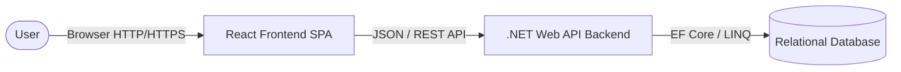
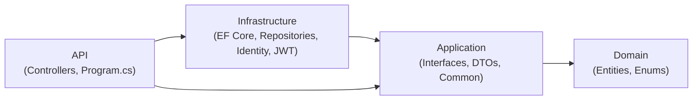

# Design Document Specification (DDS)
# Stage 3: System Design
## Project: Student-Hub

**Version:** 2.0
**Target Audience:** Development Team

---

## 1. Introduction

### 1.1 Purpose
The purpose of this document is to outline the architectural design for the **Student-Hub** application. This document serves as a guide for developers to understand the structural choices, technologies, and patterns used to implement the system.

### 1.2 Technology Stack
Student-Hub is designed as a decoupled modern web application consisting of:
- **Frontend**: React.js (Single Page Application - SPA)
- **Backend**: .NET 10 Web API (Clean Architecture)
- **Database**: Relational Database (SQL Server) using Entity Framework (EF) Core
- **Communication**: RESTful APIs over HTTPS

---

## 2. System Architecture Overview

Student-Hub follows a standard **Client-Server Architecture**. 
- The **Client** (React frontend) handles the user interface, routing, and user experience.
- The **Server** (.NET backend) handles business logic, database operations, security, and data validation.



---

## 3. Frontend Architecture (React)

The frontend will be a component-based Single Page Application. We will prioritize simplicity and clean code.

### 3.1 Project Structure
We will organize the React project by feature and type:

```text
/src
  /assets         # Images, global styles
  /components     # Reusable UI components (Buttons, Cards, Navbar)
  /pages          # Page-level components (Home, StoreMain, AgentPage, etc.)
  /services       # Logic for API calls (e.g., apiUtility.js)
  /context        # React Context for global state (e.g., AuthContext)
  /hooks          # Custom React hooks
  App.jsx         # Main application container and Routes
```

### 3.2 State Management
- **Local State**: `useState` and `useReducer` hooks for component-specific data (e.g., form inputs).
- **Global State**: React Context API for application-wide data (e.g., logged-in user profile, theme preferences). *Note: We will avoid complex libraries like Redux initially to keep it entry-level friendly.*

### 3.3 Routing
- **React Router** (`react-router-dom`) will be used to handle navigation between pages without reloading the browser.

---

## 4. Backend Architecture (.NET Web API)

The backend follows a **Clean Architecture** pattern using four separate projects. Each project enforces a strict dependency direction — inner layers never reference outer layers.

### 4.1 Projects & Dependency Flow



| Project | Purpose | Depends On |
|---|---|---|
| `StudentHub.Domain` | Entity classes + Enums — pure data models, no logic | *Nothing* |
| `StudentHub.Application` | Service interfaces, repository interfaces, DTOs, common types | Domain |
| `StudentHub.Infrastructure` | EF Core `AppDbContext`, repository implementations, Identity, JWT, seed data | Application |
| `StudentHub.API` | Controllers, `Program.cs` (DI wiring, CORS, middleware) | Application, Infrastructure |

### 4.2 Project Structure

```text
backend/
  StudentHub.slnx                       # Solution file

  StudentHub.Domain/                    # Layer 1 — Domain
    Entities/                           # User, Activity, StudentApplication, StudentProfile, AgentProfile, University
    Enums/                              # UserRole, AccountStatus, ActivityStatus, ApplicationStatus

  StudentHub.Application/               # Layer 2 — Application
    Common/                             # StandardResponse<T>
    Interfaces/                         # Repository interfaces (IActivityRepository, IUserRepository, etc.)

  StudentHub.Infrastructure/            # Layer 3 — Infrastructure
    Data/                               # AppDbContext, DbSeeder
    Repositories/                       # Repository implementations
    DependencyInjection.cs              # Extension method to register all infra services

  StudentHub.API/                       # Layer 4 — API (entry point)
    Controllers/                        # API endpoints
    Program.cs                          # Slim startup — calls AddInfrastructure()
    appsettings.json                    # Connection string, JWT settings
```

### 4.3 Repository Pattern

Each entity has its own repository interface (`Application/Interfaces/`) and implementation (`Infrastructure/Repositories/`). Repositories contain only data access logic — not business rules.

- `IUserRepository` / `UserRepository`
- `IActivityRepository` / `ActivityRepository`
- `IStudentApplicationRepository` / `StudentApplicationRepository`
- `IStudentProfileRepository` / `StudentProfileRepository`
- `IAgentProfileRepository` / `AgentProfileRepository`
- `IUniversityRepository` / `UniversityRepository`

Services (to be added in Sprint 1) will inject repository interfaces and contain the business logic.

### 4.4 Dependency Injection (DI)

.NET's built-in DI container is used. All infrastructure services (DbContext, Identity, JWT, Repositories) are registered via a single extension method in `Infrastructure/DependencyInjection.cs`, called from `Program.cs`:

```csharp
// Program.cs
builder.Services.AddInfrastructure(builder.Configuration);
```

This keeps `Program.cs` thin and groups all infrastructure setup in one place.

---

## 5. Database Architecture

We will use an Object-Relational Mapper (ORM), specifically **Entity Framework (EF) Core**, using the **Code-First Approach**.

### 5.1 Code-First Approach
Developers will write C# classes (Entities) first. EF Core will then generate the SQL commands (Migrations) to create and update the database structure automatically.

### 5.2 Key Entities
Defined in `StudentHub.Domain/Entities/`:
- **User**: Extends IdentityUser — Id, Email, Role, Status, StudentCode, UniversityId
- **StudentProfile**: FullName, NationalId, Phone, Faculty, Department, Batch
- **AgentProfile**: FullName, OrganizationName, RoleDescription
- **University**: Name, Location
- **Activity**: Title, Description, Status, StartDate, Deadline, MaxParticipants, CreatedById
- **StudentApplication**: StudentId, ActivityId, Status, AppliedAt, ReviewedAt, ReviewedById

---

## 6. API Design (RESTful)

The backend will expose RESTful endpoints. We will adhere to standard HTTP verbs and status codes.

### 6.1 Naming Conventions
- Route names should be nouns, plural, and lowercase.
- Example Endpoints:
  - `GET /api/stores` - Retrieve a list of stores/items.
  - `GET /api/stores/{id}` - Retrieve a specific item.
  - `POST /api/stores` - Create a new item.
  - `PUT /api/stores/{id}` - Update an existing item.
  - `DELETE /api/stores/{id}` - Delete an item.

---

## 7. Security Best Practices

Security must be implemented from day one, even in an entry-level project.

### 7.1 Authentication & Authorization
- **Authentication**: We will use **JSON Web Tokens (JWT)**. When a user logs in, the .NET backend verifies credentials and issues a JWT. The React frontend stores this token (e.g., in localStorage or secure cookies) and sends it in the `Authorization` header of subsequent API requests.
- **Authorization**: Role-based access control (RBAC). E.g., only "Admin" or "Agent" roles can add new Student Services.

### 7.2 Cross-Origin Resource Sharing (CORS)
Since React and .NET will likely run on different ports during development (e.g., React on port 5173, .NET on port 5001), CORS must be configured in the .NET `Program.cs` file to explicitly allow requests from the React frontend's URL.

### 7.3 Data Validation
- **Frontend**: Form validation (e.g., required fields, email format) before sending requests to improve UX.
- **Backend**: Server-side validation is mandatory. We will use Data Annotations in .NET (e.g., `[Required]`, `[MaxLength]`) on our DTOs to ensure malicious or invalid data never reaches the database.
